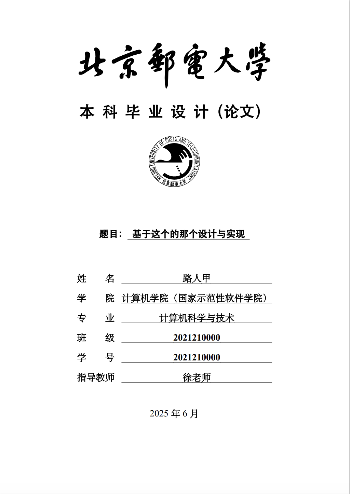
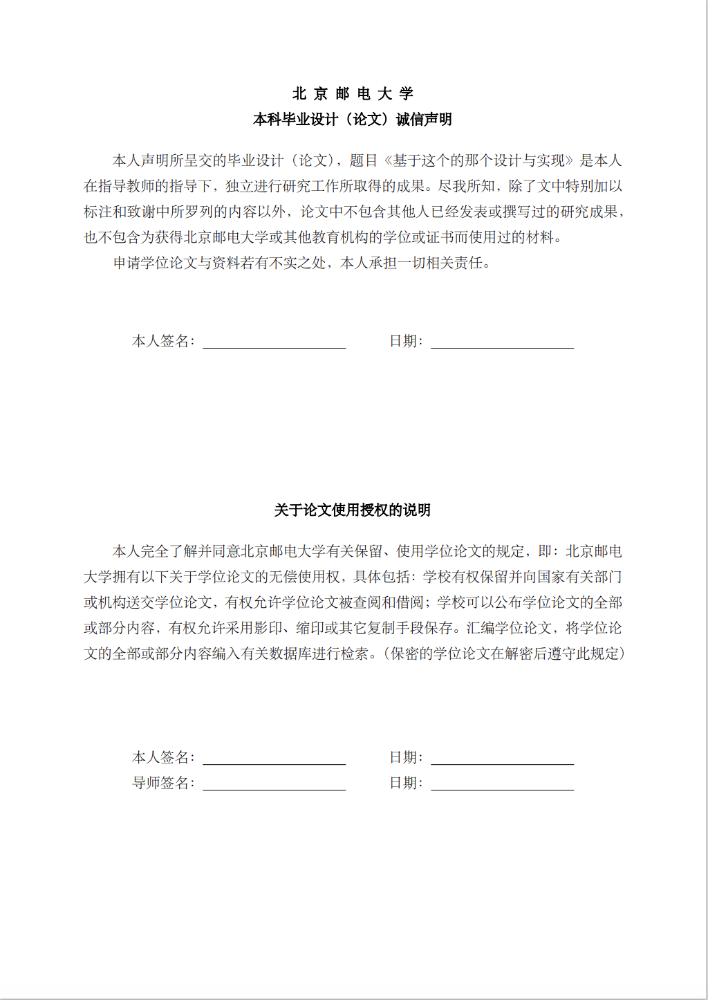
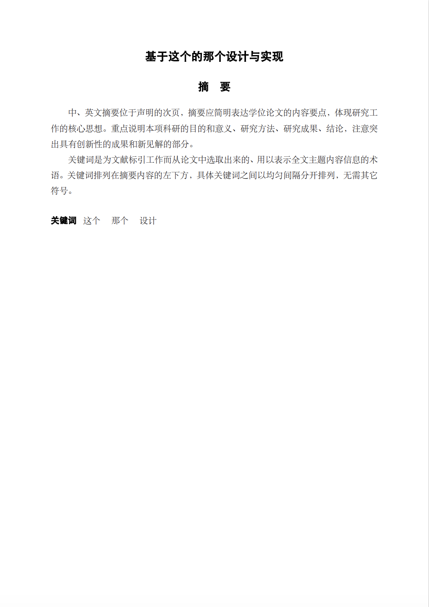
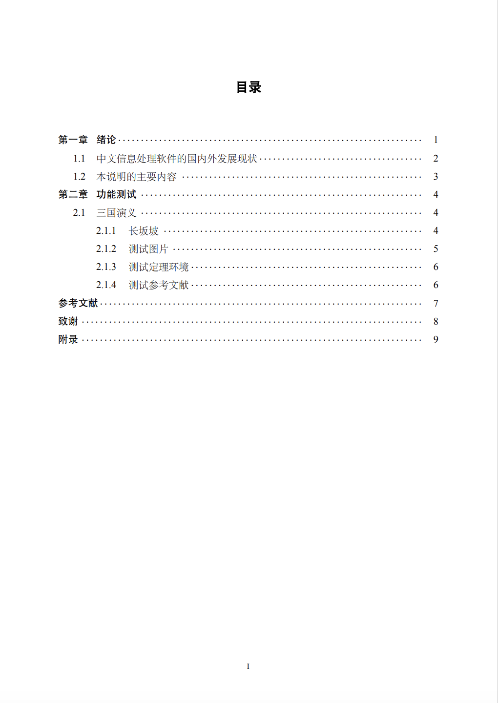
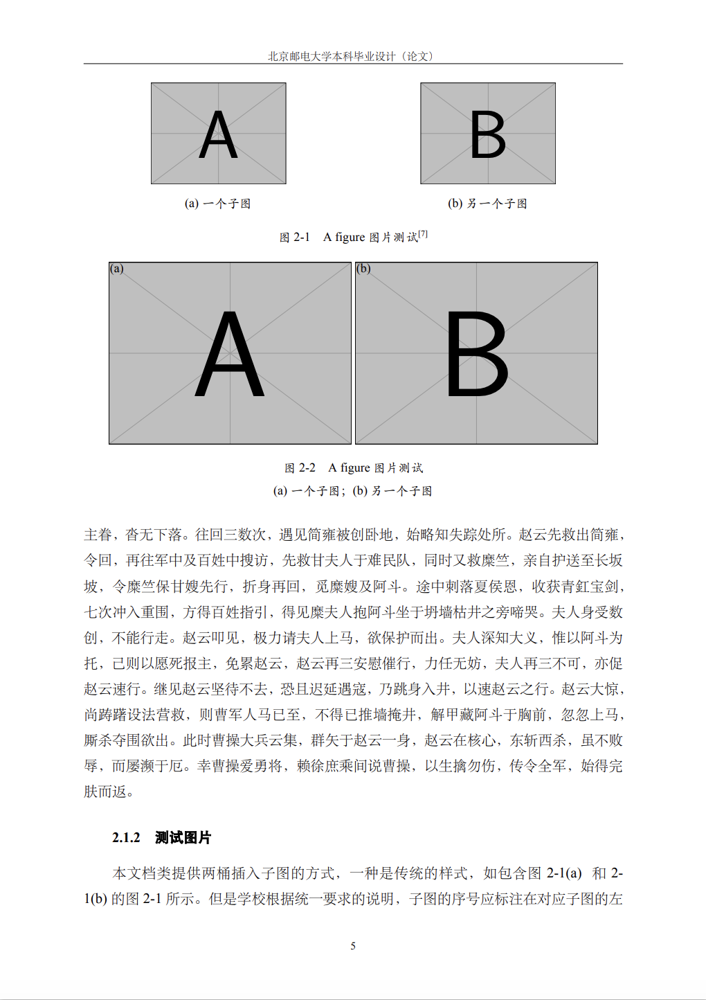
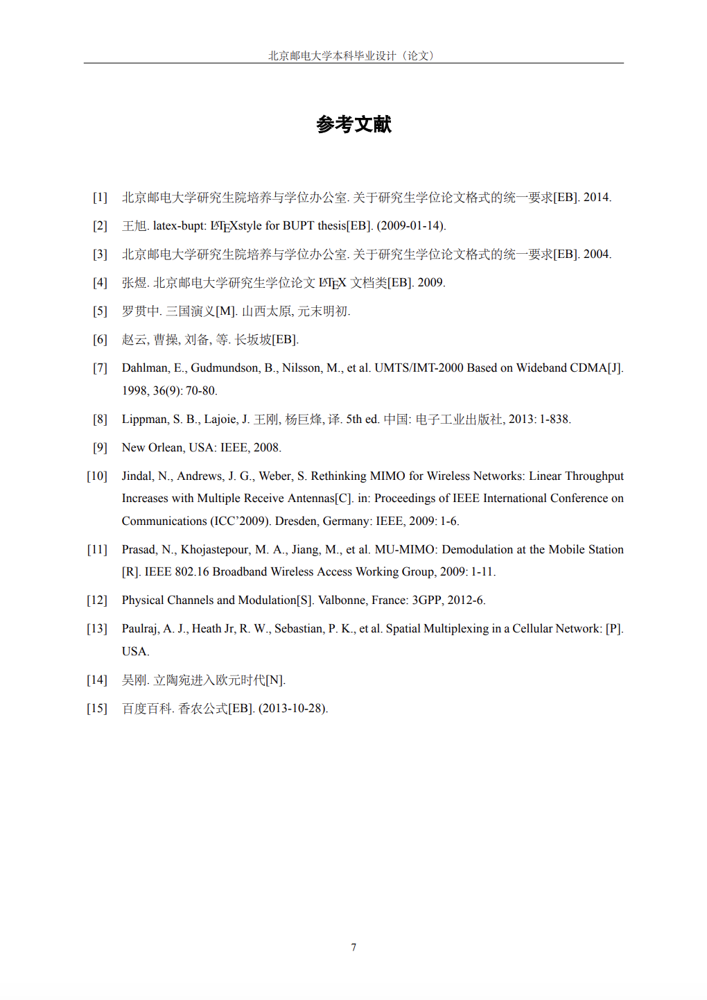
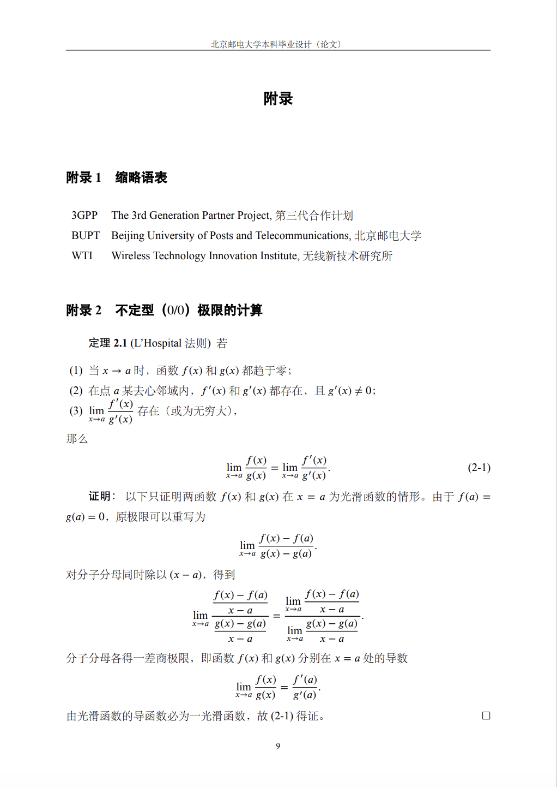

**警告：本项目非官方实现，出现问题概不负责。**

# 北京邮电大学本科毕业设计LaTeX模板 | BUPTBachelorThesis

## 简介

本项目为基于北京邮电大学教务处发布的《北京邮电大学2025届本科毕业设计（论文）指导手册》中的格式要求编写的中文LaTeX模板。

## 快速上手

如果你希望快速使用本项目进行毕业设计（论文）的编写，你可以参考以下步骤进行快速上手，或阅读**使用说明**部分：

1. 在[Overleaf](https://www.overleaf.com/)上注册、登录并创建新项目。Overleaf是在线的多人共享LaTeX编辑平台。
2. 下载本项目的全部文件。`figs`文件夹中包含的图片可以删除，为`README.md`中用到的图片。
3. 清空你的Overleaf项目中的所有文件，并将本项目的全部文件上传到项目中。
4. 点击Overleaf项目中的设置（左下角），选择编译设置标签页（Compiler），将主要文档（Main Document）选择为bare_thesis.tex，并重新编译（Recompile）文件。你应当能够看到右侧窗口显示编译后的文件。你可以阅读该文件及文件名为`ch_***.tex`的文件来了解如何使用本项目。

## 预览

|  [封面](metadata.tex)   |              诚信声明              |
| :---------------------: | :--------------------------------: |
|  |  |

|        [中文摘要](abstract.tex)        |         目录          |
| :------------------------------------: | :-------------------: |
|  |  |

|    [图片与子图](ch_concln.tex)     |       [参考文献](pubs.bib)       |
| :--------------------------------: | :------------------------------: |
|  |  |

|    [致谢](thanks.tex)    |  [附录](app_lhospital.tex)   |
| :----------------------: | :--------------------------: |
|  |  |

## 使用说明

**以下内容部分参考了[原项目](https://github.com/qcts33/BUPTthesis-ctex)的README。**

### 编译

由于本项目采用一些较新的工具来实现功能，对于老版本的LaTeX系统可能存在兼容性问题，建议使用最新的TeX Live或者MiKTeX来进行编译。

*注意：虽然 CTeX 套装的使用依然很广泛，但由于 CTeX 套装已经多年没有维护，本项目不对 CTeX 套装的兼容性做任何保证。*

虽然 CTeX 宏包可以自行适应编译引擎，但由于开发过程中主要使用 XeLaTeX 进行测试，故强烈建议使用 XeLaTeX 引擎来进行编译。
为了实现引用、编号等功能，可使用以下命令进行编译。

```
latexmk %DOC%
```
本项目提供了相应的 latexmkrc 文件用以定义 latexmk 的行为。
为了保证每次编译的速度以及效果，强烈建议大家采用 latexmk。
（在MikTex下使用 `latexmk` 可能需要单独安装一个 [Perl](http://strawberryperl.com/)）

另外也可以直接使用以下命令
```
xelatex %DOC%
makeglossaries %DOC%
biber %DOC%
xelatex %DOC%
xelatex %DOC%
```

`makeglossaries %DOC%` 不用在写作的过程中反复的运行，这个并不影响正文中的输出，所以只需在编译最终版的时候执行一次用以生成缩略语表即可。

### 选项

- `txmath` 使用该选项启用 Times 字体的数学部分。
- `xits` 使用 XITS 项目提供的字体。
- `review` 用以自动在扉页上隐藏个人信息。
- `chapterbib` 默认将引文列在正文的末尾，可使用该选项将采用文献列在各章的末尾。

### 伪粗体

本文档类已经基于教务给定的要求，为论文中需要使用加粗的位置使用了伪粗体（伪粗体的实现见`cjkfakebold.sty`，没有使用`AutoFakeBold`选项是由于其在`XeLaTeX`下会导致粗体汉字无法被正确复制，感谢[Stack Exchange上的用户Leo Liu提供的解决方案](https://tex.stackexchange.com/a/180448)）。注意该方案可能会导致部分字符（如标点符号）的间距出现问题，但考虑到伪粗体在论文中实际使用的场合，认为该问题是可以接受的。本文档类中`\textbf`对中文内容的默认行为是使用黑体，如果你希望使用伪粗体，请使用`\CJKfakebold`命令，用法与`\textbf`类似。由于部分平台上字库（如Overleaf下ctex默认使用的Fandol字库）中黑体具有粗体特性，因此在部分平台（尤其是Overleaf）上，标题中设置了伪粗体的黑体可能出现异常加粗。如果遇到了该问题，可以设置文档类的`noboldheiti`选项来禁用黑体字标题的伪粗体。

还有一个替代方案是自行选择一个粗宋体字体，将字体文件重命名为`bsong.ttf`。本文当类将在发现`bsong.ttf`文件之后自动使用其中的字体来绘制中文封面。
在进行了一些对比之后，我发现[汉仪中宋](http://www.hanyi.com.cn/productdetail.php?id=973)的字重跟 Word 中的加粗宋体比较接近，而且是个人使用免费，推荐给大家。使用效果可参见`bare_thesis.pdf`的封面。由于我不知道二次分发自己下载的字体会不会有问题，麻烦大家自行前往汉仪的网站下载。

另外，如果`cover.pdf`和`cover.tex`都没有找到，文档类会直接放弃绘制扉页。

### 引文格式

本项目采用[biblatex-gb7714-2015](https://www.ctan.org/pkg/biblatex-gb7714-2015)来处理引文格式，产生的引文格式符合GB7714-2015的要求。

如果编译时出现```Package xkeyval Error: `gbnamefmt' undefined in families `blx@opt@pre`. [\blx@processoptions]``` 请更新biblatex-gb7714-2015的版本。

### 自动缩略语

本项目继承了原项目的自动缩略语功能，不过`\gls{}`的输出会造成中英文混排的时候仍然会存在自动空格不出现的问题。
这个问题暂时无解，所以需要大家手动控制一下`\gls{}`两侧的空格。
另外编译的时候需要多加一个`makeglossaries %DOC%`

### 外文资料

本模板还包括了外文资料的处理模板，详见`foreign_lit`。

## 常见问题

### 为什么要使用$\LaTeX$？

在毕业设计（论文）中使用$\LaTeX$的优势在于它能提供专业级的排版和一致的格式控制，尤其擅长数学公式、图表与表格的排版；通过BibTeX可实现参考文献的自动管理与样式切换，避免手动格式错误；目录、交叉引用、索引与附录能自动生成，保证编号与引用始终准确；与Git等版本控制以及自动化编译工具（如latexmk）配合良好，便于多人协作与可重复构建；模板化的文档结构能强制遵守学校格式要求、提高可维护性，且生成的PDF具备印刷级质量。

LaTeX在可靠性、可重复性和专业外观方面相比传统Word处理软件具有显著优势，长期来看能为论文撰写与排版节省大量时间与精力。

### 为什么我要使用这个项目？

在本项目之前已有多个为北邮本科生毕业设计（论文）的LaTeX文档类，如[BYRIO/BUPTBachelorThesis](https://github.com/BYRIO/BUPTBachelorThesis)和[jackfiled/BUPTBachelorThesis](https://github.com/jackfiled/BUPTBachelorThesis)。但经过测试，发现该文档类仍然存在着一些问题。例如，该文档类未能在LaTeX下实现封面和诚信声明，而是采用在Word中填写，并使用`pdf`格式导入项目中；并且，在Overleaf平台上使用时，需要额外的调整方可正常编译，这为用户在使用该项目时带来了不必要的额外工作量；此外，这些文档类的附录不具有自动编号功能，用户需要手动设置附录序号，类似于`\section*{附录1\quad{}...}`，为用户编写文章引入了更多的负担。

本项目基于[qcts33](https://github.com/qcts33)前辈建立的[BUPTthesis-ctex](https://github.com/qcts33/BUPTthesis-ctex)文档类，原项目在Overleaf上被收录为模板，经历了时间的考验，且整体结构也更为简单、清晰，功能更加丰富、现代，本文档类同样也能在Overleaf平台上实现几乎开箱即用的体验。本项目根据北京邮电大学教务处发布的《北京邮电大学2025届本科毕业设计（论文）指导手册》中的格式要求，实现了封面到附录部分的内容。相比已有的本科毕业设计（论文）文档类，本项目使用分散子文件的形式组织各个章节，附录具有自动编号功能，还从原文档类继承了包括自动缩略语表在内的丰富功能，提升了用户使用本文档类编写论文的体验。此外，本文档类已通过教务处要求的自动格式检测平台（论无忧）的检测，并且不存在任何错误，不存在模板本身导致的警告。

作者已使用本项目完成毕业设计（论文）的编写并顺利通过。

## 注意事项

如果您在使用该项目时遇到任何问题，欢迎在Issues中提出！

本文档类使用了`xits`选项，使用`unicode-math`包指定数学字体，并修改了西文字体为Times New Roman，这是为了设置并正常加载Times New Roman以通过自动格式检测平台（论无忧）的检测。如果你介意在文章中使用非开源字体，你可以考虑将`BUPTthesis.cls`中的Times New Roman相关内容替换为TeX Gyre Termes，或将`xits`选项更改为`txmath`（不建议这么做，尤其是如果您正在使用`XeTeX`或`LuaTeX`作为编译引擎时）。

为满足指导手册中对子图格式的要求，文档类中使用`tikz`包实现了`\subfigwithlabel`命令，该命令会为引用的图左上角加上当前`subfigure`的编号。由于作者暂时无法实现自动调整子图图题至主图图题下方，如果要实现与教务要求中完全一致的格式，你需要手动调整图题，使得子图图题不显示，并在主图图题中显示子图图题，具体用法请参考`ch_concln.tex`

如果你对此处子图的实现有更好的想法，欢迎提出issue或PR！

## 致谢

`README_OLD.md`中为原项目（[BUPTthesis-ctex](https://github.com/qcts33/BUPTthesis-ctex)）的`README.md`文件中的内容，感谢qcts33前辈对该项目做出的巨大贡献。
